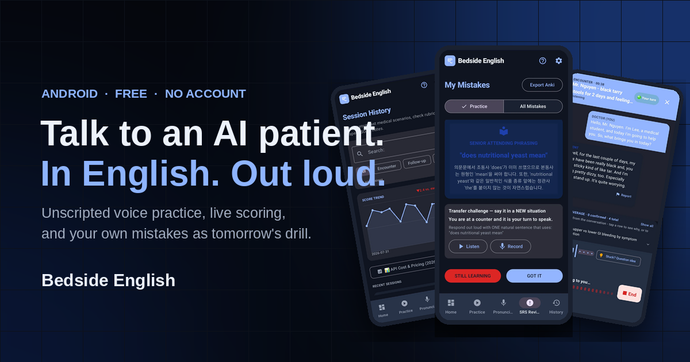

# Bedside English: Talk & Train — Landing Page



Source for the public landing page at **https://bedsideenglish.github.io/**.

A single static `index.html` (no build step) presenting both platforms of the product:

- [BedsideEnglish-Desktop](https://github.com/boyskier/BedsideEnglish-Desktop) — Windows/macOS/Linux, available now.
- [BedsideEnglish-Android](https://github.com/boyskier/BedsideEnglish-Android) — pre-launch, build from source.

Served via GitHub Pages from the `main` branch root. Edit `index.html` and push to update the live site.

## Google Analytics 4

All public HTML pages use the GA4 measurement ID `G-FK1EXM7ZKH`. The three Python-generated
libraries inherit the tag from their templates, so regenerating pages preserves analytics. Before
publishing, verify both current and generated pages with:

```powershell
python tools\check-ga4.py
```

## Clinical English learning pages

Reviewed patient-case JSON files can be converted into static communication guides under
`learning/`. The publication allowlist and reviewed titles live in `learning-pages.json`; page
markup lives in `tools/learning_templates/` and shared presentation lives in
`learning/styles.css`. No source case JSON is copied into the public site.

Generate the reviewed selection from this workspace on Windows:

```powershell
python tools\generate-learning-pages.py
```

Generate one specific case by ID or path (a neutral ID-based slug is used unless `--slug` is
provided):

```powershell
python tools\generate-learning-pages.py --case gi_011 --slug swallowing-difficulty-history-questions
```

The default case source is the sibling Android repository at
`..\Medvoicetrainer-android-app-version\data\cases`. Override it with `--source-root` when the
workspace layout differs. The generator has intentionally no mass-generation option.

Published manifest entries must include a plain-language quick answer, an editorial update date,
and at least two reviewed wording explanations. `question_edits` can replace or split a source
question and add `Why this wording` comparisons without changing the application's source case.
Each generated page also records the source JSON SHA-256 in an HTML comment, so `--check` catches
stale pages after any source-case change.

Public learning content follows **American English (`en-US`)**, matching the app's USMLE audience.
Every manifest entry must set `language_standard` to `en-US` and confirm
`patient_answer_assumptions_checked`. Generation fails on known British-style patient wording such
as `practise`, `felt sick`, or `open your bowels`, and on presupposition markers such as `each time`
or `you mentioned`. These deterministic checks are a review aid, not a replacement for reading each
question for subtler leading assumptions before publication.

## Model history-taking conversations

Audio-first worked histories live under `model-interviews/`, separate from the explanatory
`learning/` guides. The manifest is `model-interview-pages.json`; each entry contains the exact
doctor-patient transcript, audio segment boundaries, distinct Gemini voice pair, flow summary,
and reviewed source links. Generated pages and pre-generated WAV files carry both the Android case
SHA-256 and the canonical transcript SHA-256 so case, page, and audio drift is caught before publish.

Generate or refresh static two-speaker WAV files using the workspace-level `.env` only at authoring
time. Public pages never call Gemini and never contain an API key:

```powershell
python tools\generate-model-interview-audio.py
python tools\generate-model-interview-pages.py
```

Run the complete publication gate:

```powershell
python tools\test_generate_model_interview_pages.py
python tools\generate-model-interview-pages.py --check
python tools\check-model-interview-pages.py
```

When every fingerprint still matches, the audio generator keeps the existing WAV files instead of
calling Gemini again. Use `--page <slug>` to work on one interview and `--force` only when deliberately
recasting audio with the same transcript and voices.

## Oral case-presentation guides

Worked chart-to-speech examples live under `case-presentations/`. Each page is locked to one reviewed
patient-case JSON, identifies the exact data available at the presentation moment, and explicitly
preserves missing vital signs, examination findings, allergies, or tests as unknown. The public value
is not just a model script: each guide explains clinical compression, sentence purpose, wording,
uncertainty, likely attending questions, and common repairs.

The reviewed allowlist is `case-presentation-pages.json`. Templates, the starter manifest, generator,
QA checker, and regression tests live under `tools/`; the complete human and AI authoring standard is
in `docs/case-presentation-content-system.md`.

Run the publication gate:

```powershell
python tools/test_generate_case_presentation_pages.py
python tools/generate-case-presentation-pages.py
python tools/generate-case-presentation-pages.py --check
python tools/check-case-presentation-pages.py
```

Generate one manifest entry during editing with `--page <slug>`. Do not edit generated HTML directly.

## Healthcare team communication guides

Team-to-team content is managed separately under `communication/`. It uses a chart-to-message model rather than the patient-history question template: every guide includes a fictional source chart, framework steps, a generated complete script, wording contrasts, a receiver check-back, and source-backed editorial notes.

The reviewed publication allowlist is `team-communication-pages.json`. The generator, templates, QA checker, and regression tests live under `tools/`; the complete management and editorial standard is in `docs/team-communication-content-system.md`.

Generate the reviewed team-communication library:

```powershell
python tools\generate-team-communication-pages.py
```

Generate one manifest entry during editing:

```powershell
python tools\generate-team-communication-pages.py --page sbar-nursing-handoff-example
```

Run the publication gate:

```powershell
python tools\test_generate_team_communication_pages.py
python tools\generate-team-communication-pages.py --check
python tools\check-team-communication-pages.py
```

The library includes physician-first examples for an SBAR specialty consult, I-PASS night handoff, and critical-result check-back, plus the original nursing SBAR example. Do not edit generated HTML directly; edit the manifest or templates and regenerate.

## Everyday English interactive listening guides

Everyday-English search pages live under `everyday-english/`. They use a separate hear–commit–verify template rather than the patient-question or team-framework layouts. Each reviewed page maps one search task to one real Android Listening Lab drill, hides the transcript until the learner commits structured detail answers, scores each detail, records replay/slower assistance locally, and then teaches repair and transfer.

The publication allowlist and 15 future-ready speaker profiles live in `everyday-english-pages.json`; published app-drill snapshots live in `everyday-listening-drills.json`. When the sibling Android repository is present, generation requires each snapshot to match the current app drill, so transcript, accepted-answer, difficulty, and profile changes cannot drift silently. Browser speech synthesis is the no-key fallback; reviewed audio added under `assets/audio/everyday/<drill_id>/<profile_id>.*` is picked up automatically.

Run the complete publication gate:

```powershell
python tools\test_generate_everyday_english_pages.py
python tools\generate-everyday-english-pages.py --check
python tools\check-everyday-english-pages.py
```

The full editorial, audio, SEO/GEO, scoring, and QA standard is in `docs/everyday-english-content-system.md`.

### Search discovery on GitHub Pages

This repository is deployed at the GitHub Pages hostname root. Its crawler policy is published at
`https://bedsideenglish.github.io/robots.txt` and points to the sitemap.

Submit `https://bedsideenglish.github.io/sitemap.xml` directly in Google Search Console and Bing
Webmaster Tools.

`index.html` is the single clinical-track landing page. It used to be generated from a near-identical
`android.html`; the two shared a title, a description, and all but one paragraph, so they competed for
the same queries and each declared itself canonical. `android.html` is now a `noindex` stub that
canonicalises to `/` and meta-refreshes there, because GitHub Pages cannot serve a 301. Delete it once
nothing off-site points at `/android.html`.

`android-everyday.html` is a genuinely different page — its own title, description, and hero — and stays
indexable in its own right.

Only canonical URLs belong in the sitemap. `tools/site_map.py` holds the fixed routes; `android.html`
and `android-demo.html` are deliberately absent and both carry `noindex` on the page itself.

## Assets

| Path | What it is |
| --- | --- |
| `assets/android/*.webp` | Real Android screenshots, 780px wide, Android status bar and gesture strip trimmed off. Used by the practice-loop phone and the screenshot rail. |
| `assets/android/detail/*.webp` | Close-up crops of the same captures. `hero-checklist` and `correction-wide` are cut by `tools/build-crops.py`; the rest are older 760×422 crops. |
| `assets/social/og-cover.png` | 1200×630 Open Graph / Twitter card. Referenced by `og:image` on both pages. |
| `assets/social/feature-graphic.png` | 1024×500 — the exact size Google Play requires for a store listing feature graphic. |
| `assets/social/share-square.png` | 1200×1200 square, for KakaoTalk / Instagram and anywhere a wide card is cropped. |
| `assets/app-*.png` | Older desktop-app screenshots, used only by `desktop/index.html`. |

The three files in `assets/social/` are one composition at three crops. Regenerate them all with:

```sh
python3 tools/build-social.py   # needs Pillow
```

Edit the copy or swap which screenshots appear in the stack at the top of that script — do not
retouch the PNGs by hand, or the three sizes will drift apart.

The hero's magnified checklist and the full-width correction band are straight crops of captures
already in the repo. Re-cut them after replacing either source capture:

```sh
python3 tools/build-crops.py    # needs Pillow
```

### Bed 23 preview audio

`android-demo.html` plays reviewed, pre-generated Gemini TTS clips from
`assets/audio/bed-23/`; the public page does not call Gemini or use a
browser-installed voice. To regenerate a clip locally, set `GEMINI_API_KEY` in
the workspace-level `.env` and run:

```powershell
python tools\generate-bed-23-audio.py
```

Use `--force` when deliberately replacing existing files, and `--clip
patient-opening` to remake one named line. The generator defaults to
`gemini-3.1-flash-tts-preview` and writes 24 kHz mono WAV files.

## Instagram carousel cards

Published guides are re-cut into 1080x1350 carousel slides under `assets/instagram/<slug>/`.
The pipeline exists so social posts inherit the site's editorial gate instead of working around it:
**the card manifest cannot contain clinical wording at all.** `instagram-cards.json` carries only
slide selection, hook copy, and caption copy; every clinical English sentence on a card is pulled by
field reference out of `team-communication-pages.json`, so a card can never say something the site
has not already reviewed and sourced.

A carousel is hook, one before/after slide per SBAR step, the connected script, then the call to
action — at most 10 slides, which is Instagram's carousel limit. Templates and the card stylesheet
live in `tools/instagram_card_templates/`; the two Latin-subset webfonts are vendored in
`assets/fonts/` so rendering needs no network.

Generate the slide HTML, then rasterise it:

```sh
python3 tools/generate-instagram-cards.py
python3 tools/render-instagram-cards.py
```

Rendering is authoring-time only, like the model-interview audio: it needs Playwright and a
Chromium binary, and the published site never runs it. It refuses to write a PNG for any slide whose
text escapes the card's safe area, so a sentence that is too long fails loudly instead of being
posted clipped. Use `--card <slug>` to work on one carousel and `--write-overflowing` to inspect a
failing slide.

`assets/instagram/<slug>/metadata.json` records the source guide's fingerprint and the SHA-256 of
each slide, so editing a guide invalidates the cards cut from it. Run the publication gate:

```sh
python3 tools/test_generate_instagram_cards.py
python3 tools/generate-instagram-cards.py --check
python3 tools/check-instagram-cards.py
```

Posting is deliberately manual. Upload the PNGs in filename order and paste
`assets/instagram/<slug>/caption.txt`. Slide HTML in `out/` is a render input and is not committed.

## Two switches at the top of the page script

Both live at the top of the `<script>` block in `index.html` (and in `android-everyday.html`):

| Constant | What it does while empty | What to paste in |
| --- | --- | --- |
| `GOOGLE_PLAY_URL` | The public listing URL is already configured. | Keep the published Google Play listing URL here; the status surfaces become download buttons. |
| `VOICE_CLIP_URL` | The hero button replays the silent clip and reads "Watch the 8-second clip". | A path to eight seconds of the encounter's **own** audio. The button becomes "Hear 8 seconds of it" and doubles as a mute toggle. |

`VOICE_CLIP_URL` is deliberately empty rather than wired to speech synthesis. The page's whole claim
is that everything on it is the real app, and a browser text-to-speech voice would be the one thing
on it that is not — it would also sound nothing like the voice the app actually uses. Record it by
screen-capturing an encounter with internal audio capture enabled, then export the audio alone:

```sh
ffmpeg -i encounter.mp4 -ss 0 -t 8 -vn -c:a aac -b:a 96k assets/audio/encounter-8s.m4a
```
